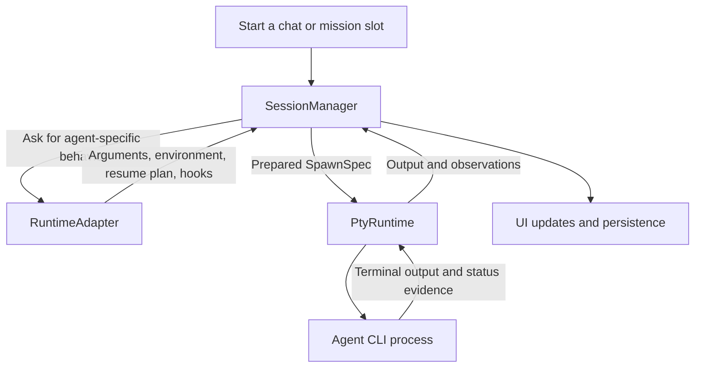
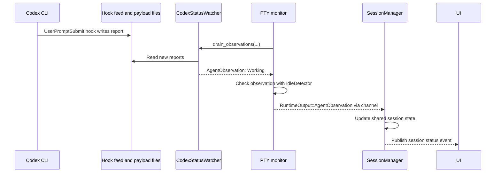

# Runtime adapters: a first code walkthrough

Written against Runner `main` on 2026-10-03, after the three parts of [#777](../features/archive/777-runtime-adapter.md) landed: launch arguments (#779), spawn hooks and status watchers (#780), and catalogs and settings (#792).

The main change is moving each agent's integration code into its own module. Previously, Codex behavior, Claude behavior, and so on were scattered across launch code, status code, settings, and other files. The refactor gives those differences a common interface: `RuntimeAdapter`.

## What “runtime” means here

Several names contain “runtime”, but they describe different responsibilities:

| Name | Responsibility | Code |
| --- | --- | --- |
| `Runtime` | Identifies the agent: Codex, Claude Code, pi, etc.; also includes Shell. | [`runner-core/src/runtime.rs`](../../crates/runner-core/src/runtime.rs) |
| `RuntimeAdapter` | Knows how Runner integrates with that particular agent CLI. | [`runtimes/mod.rs`](../../crates/runner-backend/src/runtimes/mod.rs) |
| `SessionManager` | Coordinates a session: creation, persistence, spawning, resuming, and updates. | [`session/manager/mod.rs`](../../crates/runner-backend/src/session/manager/mod.rs) |
| `SessionRuntime` / `PtyRuntime` | Runs the actual process in a pseudo-terminal, carries input/output, resizes it, and tracks process exit. | [`session/runtime.rs`](../../crates/runner-backend/src/session/runtime.rs), [`session/pty_runtime.rs`](../../crates/runner-backend/src/session/pty_runtime.rs) |

The important boundary is agent knowledge versus process management. A Codex adapter knows Codex's flags and conversation format. The PTY layer provides the terminal connection through which Codex runs. A pseudo-terminal (PTY) makes the child process behave as though it is connected to an interactive terminal.

## A simplified launch



This is a responsibility map, not a complete thread or IO diagram. In particular, status watchers also read hook feeds and the agent's own records; status evidence does not all travel through the PTY byte stream.

`SpawnSpec` is the prepared launch input: command, arguments, environment, working directory, terminal size, and metadata needed by the process layer. `SessionManager` gathers these inputs; `PtyRuntime` does not read the database to discover how to launch the session.

## Before and after the refactor

Before the refactor, shared code repeatedly selected behavior by agent:

```rust
match runtime {
    Runtime::Codex => /* Codex flags */,
    Runtime::ClaudeCode => /* Claude flags */,
    // ...
}
```

That pattern appeared in many places. Supporting another agent meant finding and updating all of them.

Now shared code obtains an adapter and asks it for the behavior:

```rust
let adapter = crate::runtimes::for_key(&role.runtime);
let plan = adapter.resume_plan(prior_key);
```

The registry in [`runtimes/mod.rs`](../../crates/runner-backend/src/runtimes/mod.rs) selects the implementation. Each agent has a directory under `runtimes/`, containing its adapter and supporting code. Optional trait methods default to no support or no extra behavior. Shell and unknown runtime keys use `NoAgent`.

For example, the [`Codex` adapter](../../crates/runner-backend/src/runtimes/codex/mod.rs) specifies how to pass the first prompt, resume a conversation, fork it, assemble launch arguments, install status hooks, and expose catalog capabilities. Shared orchestration combines the adapter's answers into a `SpawnSpec` in `SessionManager::apply_runtime_args`, in [`session/manager/spawn.rs`](../../crates/runner-backend/src/session/manager/spawn.rs).

The resulting division is: the manager coordinates the launch, the adapter supplies agent-specific rules, and the PTY implementation runs the process. The app keeps UI-specific presentation, such as icons and colors, in [`runtime_ui.rs`](../../crates/runner-app/src/runtime_ui.rs).

## Codex status: entry points and one example

There are two entry points: setting up the hooks at launch, and reading their reports while Codex runs. The implementation lives in [`codex_status.rs`](../../crates/runner-backend/src/runtimes/codex/codex_status.rs), connected to the shared session layer through the Codex adapter.

### Launch setup

The Codex adapter exposes its hook integration through `status_hooks()` in [`codex/mod.rs`](../../crates/runner-backend/src/runtimes/codex/mod.rs):

```rust
fn status_hooks(&self) -> Option<&'static dyn StatusHooks> {
    Some(&Hooks)
}
```

Its `launch_args()` also calls `codex_status_args()`, which adds configuration telling Codex to execute a reporting command on events such as `UserPromptSubmit` and `Stop`. `Hooks::env()` supplies the feed path and spawn generation through environment variables. The generation lets the feed reject reports from an earlier process launch.

When the process is launched, `PtyRuntime::spawn` in [`session/pty_runtime.rs`](../../crates/runner-backend/src/session/pty_runtime.rs) asks the adapter to create a watcher:

```rust
let hook_status = spec
    .agent_runtime
    .and_then(|runtime| crate::runtimes::adapter(runtime).status_hooks())
    .and_then(|hooks| hooks.start_watcher(&spec));
```

For Codex, `Hooks::start_watcher` reads the feed path and generation from `SpawnSpec.env` and calls:

```rust
codex_status::CodexStatusWatcher::start(
    Path::new(path),
    generation.clone(),
)
```

Unlike the empty `Codex` adapter struct, this watcher holds mutable state for this particular session: the current conversation and turn, pending tools, compaction state, and a transcript reader.

### How the injected hook configuration works

Official references, checked on 2026-10-03: [Hooks](https://learn.chatgpt.com/docs/hooks), [configuration reference](https://learn.chatgpt.com/docs/config-file/config-reference), and [one-off CLI overrides](https://learn.chatgpt.com/docs/config-file/config-advanced#one-off-overrides-from-the-cli). The external docs describe Codex's contract; the following examples explain Runner's implementation.

`-c` overrides a configuration key for this invocation, with a TOML value. Runner supplies one override for each event in `codex_status::EVENTS`. This example substitutes `REPORT_COMMAND` for the actual generated shell or PowerShell command:

```text
-c
hooks.UserPromptSubmit=[{hooks=[{type="command",command="REPORT_COMMAND",timeout=2}]}]
```

These are two separate strings in the argument vector, not one string for a shell to parse. The same configuration expressed as expanded TOML would be:

```toml
[[hooks.UserPromptSubmit]]

[[hooks.UserPromptSubmit.hooks]]
type = "command"
command = "REPORT_COMMAND"
timeout = 2
```

The nesting is event → matcher group → handlers. `type` selects a command handler; `command` specifies what to execute; `timeout` is in seconds. See the official [hook configuration shape](https://learn.chatgpt.com/docs/hooks#config-shape).

The Rust `format!` expression uses `{{` and `}}` to emit literal TOML braces. `{event}` inserts an event name, and `{command}` inserts a string serialized by `toml_edit::Value`, including its TOML quoting and escaping. This keeps shell-command text valid inside the TOML value.

Before building these overrides, Runner calls `inject_codex_hooks(role_args, ...)`. Despite its name, that helper checks whether injection is allowed; it returns false for explicit hook disable/config overrides it detects. Runner then adds `--enable hooks` and `--dangerously-bypass-hook-trust`. The latter skips persisted hook-trust review for enabled hooks for this invocation, as described in [hook trust](https://learn.chatgpt.com/docs/hooks#review-and-trust-hooks); it is separate from the agent's tool approval and sandbox settings.

### What the reporting command does

Codex passes each command hook a JSON object on stdin. For `UserPromptSubmit`, that includes the Codex session ID, turn ID, event name, and prompt. See [common input fields](https://learn.chatgpt.com/docs/hooks#common-input-fields) and [UserPromptSubmit](https://learn.chatgpt.com/docs/hooks#userpromptsubmit).

Runner's command comes from `codex_status::hook_command()`. On macOS/Linux, it invokes the per-session shell reporter prepared by `HookFeed`. The reporter saves stdin to a separate payload file and appends a small NDJSON envelope to the feed, shaped like:

```json
{"generation":"spawn-generation","hook_event_name":"UserPromptSubmit","payload_file":"runner-session.ndjson.ABC12345"}
```

This envelope is Runner's transport format, not Codex's hook input schema. The separate payload file prevents large concurrent reports from interleaving in the feed. The Windows reporter uses PowerShell and the same feed/payload arrangement.

The Codex-specific command wrapper emits `{}` on stdout and exits successfully. It reports status to Runner through files rather than adding text to the agent's prompt or making a hook decision. `CodexStatusWatcher` reads the feed and payload, interprets the event, and sends the resulting observation into the shared session layer described below.

### Example: submitting a prompt

Suppose you submit “Explain this function” in the Codex terminal. Codex executes the configured `UserPromptSubmit` reporting command. The command writes a payload file and appends a report referencing it to Runner's hook feed. This status path is separate from the PTY bytes used to render the terminal.



The `idle_monitor_thread` in [`session/pty_runtime.rs`](../../crates/runner-backend/src/session/pty_runtime.rs) repeatedly calls `watcher.drain_observations(...)`. The Codex implementation reads new reports through `HookFeed`, deserializes them as `StatusReport`, and passes them to `CodexObservation::observe`.

For a valid new `UserPromptSubmit`, after checking the session and turn IDs, `observe` clears the previous turn outcome and sets:

```rust
self.value.outcome = None;
self.value.activity = Activity::Working;
self.value.detail = None;
```

The watcher returns the updated observation through a callback. The monitor checks it with `IdleDetector::accept_hook` and sends accepted observations through the output channel. The manager's forwarder in [`session/manager/output.rs`](../../crates/runner-backend/src/session/manager/output.rs) receives them:

```rust
Ok(RuntimeOutput::AgentObservation(observation)) => {
    manager_t.publish_observation(&session_id, observation, events.as_ref())
}
```

`publish_observation` in [`session/manager/mod.rs`](../../crates/runner-backend/src/session/manager/mod.rs) updates the shared session state and publishes the status event that the UI consumes. Thus `codex_status` interprets Codex's evidence, and `SessionManager` incorporates that interpretation into Runner's session state.

## What this refactor leaves for later

#777 improves where behavior lives and deliberately preserves existing runtime behavior. The authorized model-chooser Enter fix in #792 is the documented exception. Moving status watchers into adapter directories does not centralize how session status is decided: shared code and watchers still contain several producers and precedence rules.

The separate [#791 session-state refactor](../features/791-session-state.md) is intended to centralize decisions about status, draft state, and conversation identity. That work is not part of the adapter refactor described here.

## Reading path

Follow one fresh Codex chat before tackling resume and status precedence:

1. Read `RuntimeAdapter` and the `adapter` / `for_key` registry in [`runtimes/mod.rs`](../../crates/runner-backend/src/runtimes/mod.rs).
2. Read `first_turn_argv`, `resume_plan`, and `launch_args` in the [`Codex` adapter](../../crates/runner-backend/src/runtimes/codex/mod.rs).
3. Follow `spawn_runtime_direct` into `spawn_direct_inner`, then inspect `apply_runtime_args`, in [`session/manager/spawn.rs`](../../crates/runner-backend/src/session/manager/spawn.rs).
4. Read `SpawnSpec` and the `SessionRuntime` trait in [`session/runtime.rs`](../../crates/runner-backend/src/session/runtime.rs), then `PtyRuntime::spawn` in [`session/pty_runtime.rs`](../../crates/runner-backend/src/session/pty_runtime.rs).
5. Trace output back through [`session/manager/output.rs`](../../crates/runner-backend/src/session/manager/output.rs). For the path from those bytes to painted pixels, continue with [terminal rendering](terminal-rendering.md).

The [runtime integration checklist](../arch/runtime-integration.md) describes the complete requirements for adding another agent once these boundaries are familiar.
