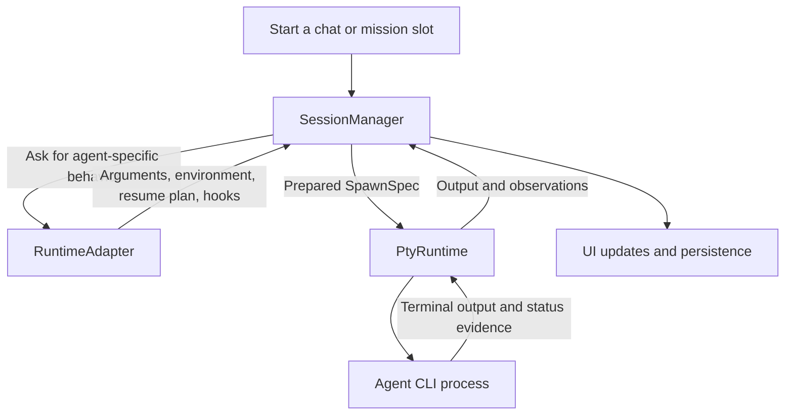

# Runtime adapters: a first code walkthrough

Written against Runner `main` on 2026-10-03, after the three parts of [#777](../features/archive/777-runtime-adapter.md) landed: launch arguments (#779), spawn hooks and status watchers (#780), and catalogs and settings (#792).

The main change is moving each agent's integration code into its own module. Previously, Codex behavior, Claude behavior, and so on were scattered across launch code, status code, settings, and other files. The refactor gives those differences a common interface: `RuntimeAdapter`.

## What “runtime” means here

Several names contain “runtime”, but they describe different responsibilities:

| Name | Responsibility | Code |
| --- | --- | --- |
| `Runtime` | Identifies the agent: Codex, Claude Code, pi, etc.; also includes Shell. | [`runner-core/src/runtime.rs`](../../crates/runner-core/src/runtime.rs) |
| `RuntimeAdapter` | Knows how Runner integrates with that particular agent CLI. | [`runtimes/mod.rs`](../../crates/runner-backend/src/runtimes/mod.rs) |
| `SessionManager` | Coordinates a session: creation, persistence, spawning, resuming, and updates. | [`session/manager/mod.rs`](../../crates/runner-backend/src/session/manager/mod.rs) |
| `SessionRuntime` / `PtyRuntime` | Runs the actual process in a pseudo-terminal, carries input/output, resizes it, and tracks process exit. | [`session/runtime.rs`](../../crates/runner-backend/src/session/runtime.rs), [`session/pty_runtime.rs`](../../crates/runner-backend/src/session/pty_runtime.rs) |

The important boundary is agent knowledge versus process management. A Codex adapter knows Codex's flags and conversation format. The PTY layer provides the terminal connection through which Codex runs. A pseudo-terminal (PTY) makes the child process behave as though it is connected to an interactive terminal.

## A simplified launch



This is a responsibility map, not a complete thread or IO diagram. In particular, status watchers also read hook feeds and the agent's own records; status evidence does not all travel through the PTY byte stream.

`SpawnSpec` is the prepared launch input: command, arguments, environment, working directory, terminal size, and metadata needed by the process layer. `SessionManager` gathers these inputs; `PtyRuntime` does not read the database to discover how to launch the session.

## Before and after the refactor

Before the refactor, shared code repeatedly selected behavior by agent:

```rust
match runtime {
    Runtime::Codex => /* Codex flags */,
    Runtime::ClaudeCode => /* Claude flags */,
    // ...
}
```

That pattern appeared in many places. Supporting another agent meant finding and updating all of them.

Now shared code obtains an adapter and asks it for the behavior:

```rust
let adapter = crate::runtimes::for_key(&role.runtime);
let plan = adapter.resume_plan(prior_key);
```

The registry in [`runtimes/mod.rs`](../../crates/runner-backend/src/runtimes/mod.rs) selects the implementation. Each agent has a directory under `runtimes/`, containing its adapter and supporting code. Optional trait methods default to no support or no extra behavior. Shell and unknown runtime keys use `NoAgent`.

For example, the [`Codex` adapter](../../crates/runner-backend/src/runtimes/codex/mod.rs) specifies how to pass the first prompt, resume a conversation, fork it, assemble launch arguments, install status hooks, and expose catalog capabilities. Shared orchestration combines the adapter's answers into a `SpawnSpec` in `SessionManager::apply_runtime_args`, in [`session/manager/spawn.rs`](../../crates/runner-backend/src/session/manager/spawn.rs).

The resulting division is: the manager coordinates the launch, the adapter supplies agent-specific rules, and the PTY implementation runs the process. The app keeps UI-specific presentation, such as icons and colors, in [`runtime_ui.rs`](../../crates/runner-app/src/runtime_ui.rs).

## What this refactor leaves for later

#777 improves where behavior lives and deliberately preserves existing runtime behavior. The authorized model-chooser Enter fix in #792 is the documented exception. Moving status watchers into adapter directories does not centralize how session status is decided: shared code and watchers still contain several producers and precedence rules.

The separate [#791 session-state refactor](../features/791-session-state.md) is intended to centralize decisions about status, draft state, and conversation identity. That work is not part of the adapter refactor described here.

## Reading path

Follow one fresh Codex chat before tackling resume and status precedence:

1. Read `RuntimeAdapter` and the `adapter` / `for_key` registry in [`runtimes/mod.rs`](../../crates/runner-backend/src/runtimes/mod.rs).
2. Read `first_turn_argv`, `resume_plan`, and `launch_args` in the [`Codex` adapter](../../crates/runner-backend/src/runtimes/codex/mod.rs).
3. Follow `spawn_runtime_direct` into `spawn_direct_inner`, then inspect `apply_runtime_args`, in [`session/manager/spawn.rs`](../../crates/runner-backend/src/session/manager/spawn.rs).
4. Read `SpawnSpec` and the `SessionRuntime` trait in [`session/runtime.rs`](../../crates/runner-backend/src/session/runtime.rs), then `PtyRuntime::spawn` in [`session/pty_runtime.rs`](../../crates/runner-backend/src/session/pty_runtime.rs).
5. Trace output back through [`session/manager/output.rs`](../../crates/runner-backend/src/session/manager/output.rs). For the path from those bytes to painted pixels, continue with [terminal rendering](terminal-rendering.md).

The [runtime integration checklist](../arch/runtime-integration.md) describes the complete requirements for adding another agent once these boundaries are familiar.
